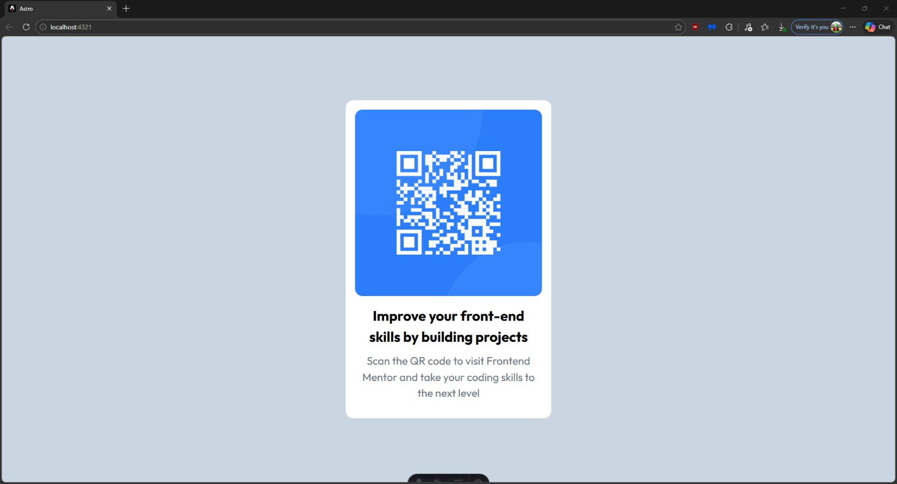

# 🧩 Proyecto: Componente QR Code

Este proyecto consiste en el desarrollo de un **componente de Código QR** utilizando **Astro** y **Tailwind CSS**.  
El objetivo es aplicar los conocimientos sobre **componentes**, **maquetación**, **estilos responsivos** y **utilidades CSS** para construir un diseño limpio, moderno y adaptable a diferentes dispositivos.

---

## 📖 Descripción general

### 🧩 Vista previa del proyecto



---

### 🔗 Enlaces del proyecto

- **Repositorio en GitHub:** [Agrega aquí la URL de tu repositorio](https://github.com/)
- **Sitio desplegado (opcional):** [Agrega aquí la URL del proyecto desplegado, si usaste Vercel o Netlify](https://)

---

## 🧠 Proceso de desarrollo

### 🛠️ Tecnologías utilizadas
Lista las herramientas y tecnologías que utilizaste en el proyecto. Por ejemplo:

- [Astro](https://astro.build)
- [Tailwind CSS](https://tailwindcss.com/)
- HTML5 semántico
- Diseño responsivo (Mobile-first)
- Componentes reutilizables

---

### 💡 Lo que aprendí
En general aprendi a crear un proyecto Astro junto con tailwind, ergo aprendi la sintaxis de astro y tailwind para realizar codigo.
Basicamente aprendi a moverme en este framework y en como buscar la informacion que necesito sobre las clases de css en tailwind
```

---

### 🚀 Áreas de mejora

Practicar mas el diseño css y tailwind, tuve algunos problemas en hacer el recuadro blanco de fondo.
---

### 📚 Recursos útiles

Incluye los enlaces, documentación o tutoriales que te ayudaron a completar este proyecto.

- [Documentación de Astro](https://docs.astro.build)  
- [Guía oficial de Tailwind CSS](https://tailwindcss.com/docs)  
- [tutoriales de w3schools](https://www.w3schools.com/)

---

### 👩‍💻 Autor

- **Nombre completo: Emmanuel Pedroza Perez**  
- **Carrera: Ing. Tecnologias de la Informacion y Comunicaciones**  
- **Grupo: TC1**  
- **Correo institucional: 23151202@aguascalientes.tecnm.mx**  

---

### ✨ Reflexión final

Aunque crear el proyecto de Astro - tailwind fue algo tedioso, la creacion de la pagina web fue bastante sencillo
una vez acostumbrado al nuevo ambiente de trabajo, aunque en la creacion del codigo tuve los mismos problemas
a la hora de hacer los estilos de diseño con el padding, ancho, alto y escalado segun el tamaño de la pantalla